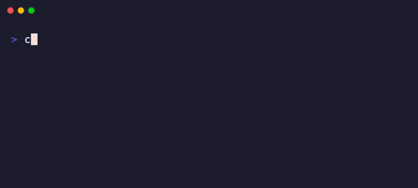

<p align="center">
  
</p>

<h1 align="center">moonpack</h1>

<p align="center">
  Lua bundler for MoonLoader scripts.<br/>
  Split your code into modules, bundle into a single file.
</p>

<p align="center">
  <a href="https://www.npmjs.com/package/moonpack"></a>
  <a href="https://www.npmjs.com/package/moonpack"></a>
  <a href="https://github.com/user/moonpack/blob/main/LICENSE"></a>
</p>

---

<p align="center">
  
</p>

## Installation

Requires [Bun](https://bun.sh).

```bash
bun install -g moonpack
```

## Quick Start

### 1. Initialize a project

```bash
moonpack init
```

This creates:
- `moonpack.json` - project config (commit this)
- `moonpack.local.json` - your local paths (gitignored)
- `src/main.lua` - entry point

### 2. Build

```bash
moonpack build
```

Bundles all your modules into a single `YourScript.lua` file.

### 3. Watch mode

```bash
moonpack watch
```

Watches for changes, rebuilds instantly, and hot-reloads the script in-game. Also tails `moonloader.log` so you see script output right in your terminal.

## Configuration

### moonpack.json

Shared config - commit this to your repo.

```json
{
  "name": "MyScript",
  "version": "1.0.0",
  "author": "YourName",
  "entry": "src/main.lua"
}
```

| Field | Required | Description |
|-------|----------|-------------|
| `name` | Yes | Output filename and `script_name()` |
| `entry` | Yes | Entry point path |
| `version` | No | `script_version()` |
| `author` | No | `script_author()` - use array for multiple authors |
| `description` | No | `script_description()` |
| `url` | No | `script_url()` |

### moonpack.local.json

Machine-specific config - add to `.gitignore`.

```json
{
  "outDir": "C:/Games/GTA SA/moonloader"
}
```

Set `outDir` to your MoonLoader folder for hot-reload to work.

## Writing Modules

Use relative paths to import local modules:

```lua
-- src/main.lua
local utils = require('./utils')
local player = require('./core/player')

function main()
    utils.log('Script loaded!')
end
```

```lua
-- src/utils.lua
local M = {}

function M.log(msg)
    print('[MyScript] ' .. msg)
end

return M
```

### What gets bundled

| Require | Bundled? | Result |
|---------|----------|--------|
| `require('./utils')` | Yes | Included in bundle |
| `require('./core/player')` | Yes | Included in bundle |
| `require('../shared/lib')` | Yes | Included in bundle |
| `require('lib.samp.events')` | No | Left as-is |
| `require('mimgui')` | No | Left as-is |

**Rule:** Paths starting with `./` or `../` are bundled. Everything else is left alone.

### Directory modules

If `./utils.lua` doesn't exist, moonpack looks for `./utils/init.lua`.

## Features

### Dev mode flag

Bundles include a `__DEV__` variable - `true` in watch mode, `false` in build.

```lua
if __DEV__ then
    print('[DEBUG] player:', inspect(player))
end
```

### Auto-localization

Functions in modules are automatically made `local`. This:

```lua
-- src/utils.lua
function helper()
    -- ...
end
```

Becomes:

```lua
local function helper()
    -- ...
end
```

MoonLoader callbacks like `sampev.onServerMessage` are preserved.

### Lint warnings

moonpack warns you about common issues:

- **Duplicate handlers** - multiple files assigning to the same `sampev.onX` handler
- **Misplaced events** - MoonLoader events (`main`, `onScriptTerminate`, etc.) in modules instead of entry point
- **Unused requires** - `local x = require(...)` where `x` is never used

### Script metadata

Config fields are injected into your bundle:

```lua
script_name('MyScript')
script_version('1.0.0')
script_author('YourName')
```

## Bundle Output

The bundled file looks like this:

```lua
-- MyScript v1.0.0
-- Built with moonpack

local __DEV__ = false
local __modules = {}
local __loaded = {}

local function __load(name)
    if __loaded[name] then return __loaded[name] end
    if __modules[name] then
        __loaded[name] = __modules[name]()
        return __loaded[name]
    end
    return require(name)
end

__modules["utils"] = function()
    -- utils.lua
    local M = {}
    -- ...
    return M
end

-- main.lua
local utils = __load('utils')

function main()
    -- ...
end
```

Modules are wrapped in functions and loaded on-demand. External requires fall through to the standard `require()`.

## Limitations

- **No circular dependencies** - moonpack will error if modules depend on each other in a cycle
- **Path-based requires only** - use `./` or `../` for local modules

## Comparison

How does moonpack compare to other Lua bundlers?

| Feature | moonpack | [luapack](https://github.com/le0developer/luapack) | [luabundler](https://github.com/Benjamin-Dobell/luabundler) |
|---------|----------|---------|------------|
| **Focus** | MoonLoader scripts | General Lua | General Lua |
| **Runtime** | Bun | Lua | Node.js |
| **Config file** | ✓ | ✗ | ✗ |
| **Watch mode** | ✓ | ✗ | ✗ |
| **Hot-reload** | ✓ | ✗ | ✗ |
| **Log tailing** | ✓ | ✗ | ✗ |
| **Linting** | ✓ | ✗ | ✗ |
| **Minification** | ✗ | ✓ | ✗ |
| **Unbundle** | ✗ | ✗ | ✓ |
| **Plugin system** | ✗ | ✓ | ✗ |
| **Auto-localization** | ✓ | ✗ | ✗ |
| **Script metadata** | ✓ | ✗ | ✗ |

**moonpack** is purpose-built for MoonLoader development with watch mode, hot-reload, and lint warnings for common script issues.

**luapack** is a general-purpose Lua bundler with minification and a plugin system for different Lua dialects (YueScript, MoonScript).

**luabundler** is a CLI tool that can both bundle and unbundle Lua files, useful for debugging or modifying existing bundles.

## License

MIT
